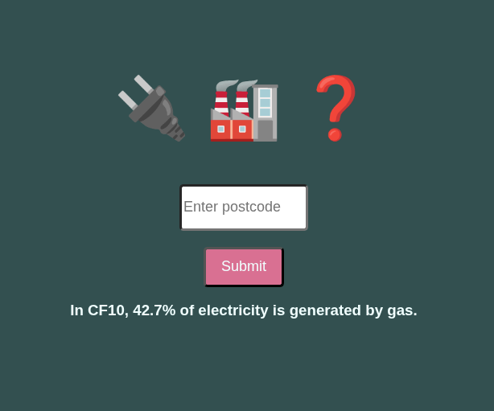

# Localgas UK
## App to practice using an API

This was my first time using an API and displaying the data. This app works by taking a UK postcode and sending it to a API about UK electricity generation. It returns the percentage of local electricity that is being generated by gas-fired power stations. If the postcode cannot be located, the app fall back to national average data.

